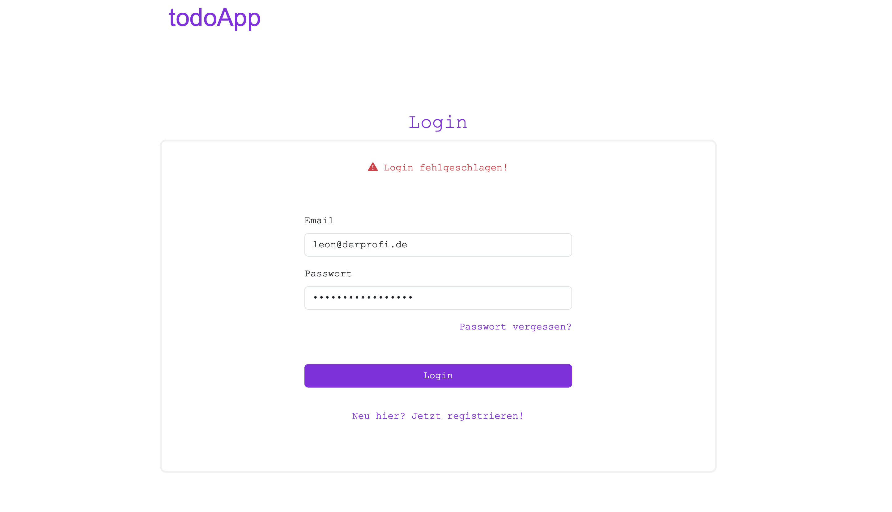
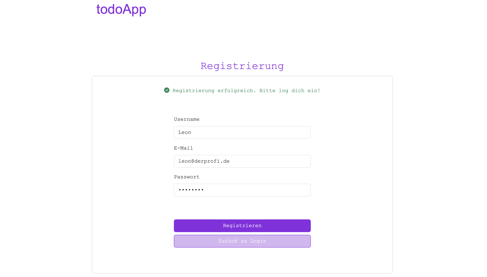

# todoApp

## Beschreibung

Die todoApp ist eine benutzerfreundliche, responsive und intuitive Anwendung zur Verwaltung von ToDos. Sie ermöglicht das Erstellen, Bearbeiten und Löschen von Aufgaben. Erledigte Aufgaben können archiviert werden, um den Fokus auf die aktuellen Aufgaben zu bewahren. Dank der integrierten Suchfunktion können Aufgaben schnell und effizient gefunden werden. Zudem bietet die App eine Filteroption, mit der Aufgaben basierend auf ihrer Priorität angezeigt werden können, was eine optimale Organisation und Priorisierung ermöglicht.

## Installation

Frontend-Repository:  
`https://github.com/magdalenajustyna/toDoList.git`

```
cd toDoApp
npm install
ng serve
```

Backend-Repository:  
`https://github.com/magdalenajustyna/toDoList_BE.git`

```
npm install
node server.js (oder node --watch server.js)
```

Anwendung im Browser starten:  
`http://localhost:4200`

## Technologien

- Frontend: Angular
- Backend: Node.js, Express
- Datenbank: MongoDB (Atlas)
- CSS-Framework: Bootstrap

## KI-Nutzung

ChatKI(ChatGPT an der HTW Berlin) zur Fehleranalyse, Fragen zu Layout-Design, Datepicker, Login einbinden im Frontend, Sort-Methoden 

## Screenshots







